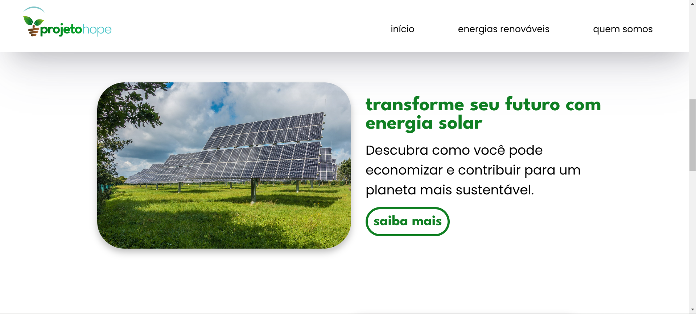
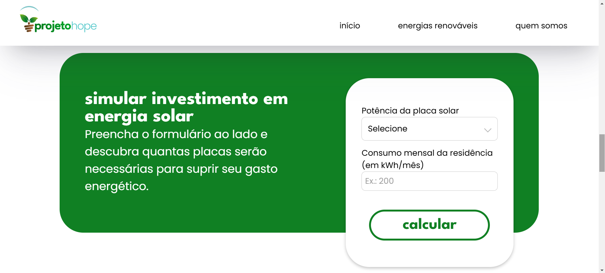

## 📝🌍 Descrição

O **Projeto Hope** é um site educativo e interativo voltado para a promoção e conscientização sobre o uso de energias renováveis, com um foco especial na energia solar. Ele foi desenvolvido com o objetivo de informar e motivar as pessoas a adotarem soluções energéticas mais sustentáveis, contribuindo para a preservação do meio ambiente e para a economia doméstica.  

### 🔍 **Estrutura do Site**:
1. **🏠 Página Inicial (Home)**:  
   - ⚡ Introduz os visitantes ao tema das energias renováveis.  
   - 🌎 Destaca a importância de fontes limpas e sustentáveis para o futuro do planeta.
2. **☀️ Energia Solar - Cálculos e Informações**:  
   - Explora os conceitos de energia solar, sua eficiência e impacto ambiental.  
   - Contém uma ferramenta prática que permite calcular a **quantidade de placas solares** necessárias para atender ao consumo energético de uma residência.  
     - O cálculo é baseado nos dados fornecidos pelo usuário, como o consumo mensal e a potência das placas.  
   - Inclui informações detalhadas sobre a importância da energia solar como solução sustentável e econômica, incentivando sua adoção.

3. **📄 Páginas Informativas**:
   - **🌊 Energia Hidrelétrica**:  
     Apresenta informações sobre a geração de energia a partir da água, suas vantagens e impactos ambientais.  
   - **💨 Energia Eólica**:  
     Detalha como a energia do vento é captada, seus benefícios e aplicações.  

### 🎯 **Objetivo Geral**:
O site visa incentivar a transição para fontes renováveis de energia, com ênfase na energia solar, através de informações acessíveis e recursos úteis. Além disso, busca desmistificar o processo de adoção de energia solar, mostrando seus benefícios financeiros e ambientais, ajudando os usuários a compreenderem como essa mudança pode impactar positivamente suas vidas.

### 🚀 **Diferenciais**:
- ⚡ Informações claras e diretas sobre diferentes tipos de energias renováveis.  
- 🤖 Ferramenta interativa para cálculos de consumo e planejamento de instalação de sistemas solares.  
- 🎨 Design acessível e intuitivo, permitindo que qualquer pessoa possa explorar e aprender mais sobre energia limpa.

💚💡 O **Projeto Hope** representa um passo em direção à conscientização ambiental e ao incentivo prático para a adoção de soluções sustentáveis, promovendo um futuro mais verde e consciente.

## 🚀 Como Usar

1. **Acesse o site**: [Projeto Hope](https://projetohope.netlify.app).  
2. **Navegue até a página de Energia Solar**: [Energia Solar](https://projetohope.netlify.app/views/energiasolar/).  
3. **Preencha o formulário** com as seguintes informações:
   - **Potência da placa solar (em watts)**: selecione a potência nominal da placa solar desejada a partir de uma lista de opções disponíveis.
   - **Consumo mensal de energia (em kWh)**: insira o valor aproximado do consumo mensal da sua residência.  
4. **Confira os resultados**:
   - O sistema calcula automaticamente a **quantidade de placas solares** necessárias para atender ao seu consumo mensal.  

Com este processo simples, você obtém rapidamente a estimativa de placas solares que melhor atende às suas necessidades, considerando o consumo mensal de energia e a potência da placa escolhida.

## 🌐 Demo  

🔗 **Acesse o Projeto Hope e veja como é fácil planejar sua transição para a energia solar:**  
👉 [Projeto Hope - Clique aqui para acessar](https://projetohope.netlify.app)

### 🌟 **Explore as Funcionalidades:**  
- **🏠 Página Inicial**: Descubra os benefícios das energias renováveis.  
- **☀️ Energia Solar**: Faça cálculos interativos para estimar a quantidade de placas solares necessárias para o seu consumo.  
- **📄 Páginas Informativas**: Saiba mais sobre energias hidrelétrica e eólica.

👀 Experimente o site, teste os cálculos e conheça o potencial transformador da energia limpa!  
---

  

## 📊 Tela de Demonstração

Aqui estão algumas capturas de tela do **Projeto Hope** em funcionamento:

- **Página Inicial**:

  

- **Calculadora de Energia Solar**:

  

## 🖥️ Tecnologias Utilizadas

  

## 👥🌱 Integrantes

<table>
  <tr>
  <td align="center">
       
      <strong>Kaique Gonçalves</strong> 
      
      
    </td>
    <td align="center">
       
      <strong>Lucas Peixoto</strong> 
      
      
    </td>
    <td align="center">
       
      <strong>Pedro Henrique</strong> 
      
      
    </td>
    <td align="center">
       
      <strong>Samuel Rodrigues</strong> 
      
      
    </td>
    <td align="center">
       
      <strong>Victor Augusto</strong> 
      
      
    </td>
  </tr>
</table>

